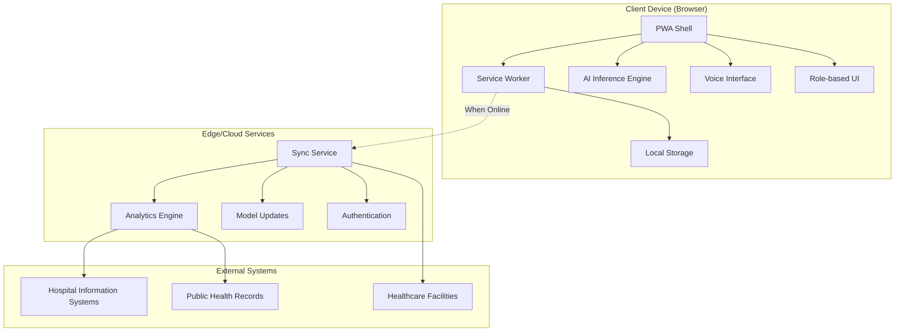

# Design Document: SwasthyaSathi AI

## Overview

SwasthyaSathi AI is a Progressive Web Application (PWA) designed to provide AI-powered healthcare decision support for India's rural and semi-urban populations. The system operates with an offline-first architecture, utilizing on-device AI inference to ensure privacy and accessibility in low-connectivity environments.

The system serves three primary user groups:
- **Frontline Health Workers**: ASHA workers, PHC staff, NGOs providing direct patient care
- **Patients**: Individuals seeking health guidance and accessing their records
- **Administrators**: Public health officials managing population health and system oversight

Key differentiators include on-device AI processing, multilingual voice interaction, explainable AI risk scoring, and seamless offline operation designed specifically for the Indian healthcare context.

## Architecture

### High-Level Architecture



### PWA Architecture

The Progressive Web Application follows a shell-and-content architecture optimized for low-end devices:

**Application Shell**:
- Minimal HTML/CSS/JS framework (<500KB total)
- Service worker for offline functionality and caching
- Responsive design supporting 320px+ screen widths
- Touch-optimized interface with large tap targets (44px minimum)

**Content Strategy**:
- Lazy loading of non-critical components
- Aggressive caching of AI models and core functionality
- Progressive enhancement for advanced features
- Graceful degradation on resource-constrained devices

**Performance Optimizations**:
- Code splitting by user role and functionality
- WebAssembly for computationally intensive AI operations
- IndexedDB for structured data storage
- Background sync for data synchronization

### Edge vs Cloud AI Responsibilities

**On-Device AI (Edge)**:
- Primary health risk assessment and scoring
- Symptom analysis and pattern recognition
- Basic referral recommendations
- Voice processing and natural language understanding
- Patient data processing and privacy-sensitive operations

**Cloud AI (When Available)**:
- Model training and updates
- Population-level analytics and trend analysis
- Advanced outbreak detection algorithms
- Performance monitoring and model optimization
- Integration with external health databases

**Hybrid Approach**:
- Edge-first processing with cloud enhancement
- Intelligent model synchronization based on connectivity
- Fallback mechanisms ensuring full offline functionality
- Privacy-preserving federated learning for model improvements

## Components and Interfaces

### Core Components

#### 1. PWA Engine
**Responsibilities**:
- Application lifecycle management
- Service worker coordination
- Resource caching and optimization
- Cross-platform compatibility

**Key Interfaces**:
```typescript
interface PWAEngine {
  initialize(): Promise<void>
  installServiceWorker(): Promise<ServiceWorkerRegistration>
  updateCache(resources: Resource[]): Promise<void>
  getOfflineStatus(): boolean
}
```

#### 2. AI Inference Engine
**Responsibilities**:
- On-device machine learning inference
- Health risk assessment computation
- Model loading and management
- Performance optimization for low-end devices

**Key Interfaces**:
```typescript
interface AIInferenceEngine {
  loadModels(): Promise<void>
  assessHealthRisk(patientData: PatientInput): Promise<RiskAssessment>
  explainAssessment(assessment: RiskAssessment): Explanation
  updateModels(newModels: ModelUpdate[]): Promise<void>
}

interface RiskAssessment {
  chronicRisk: number
  infectiousRisk: number
  preventiveRisk: number
  confidence: number
  explanations: string[]
  recommendations: string[]
}
```

#### 3. Voice Interface
**Responsibilities**:
- Multilingual speech recognition and synthesis
- Natural language processing for health queries
- Audio input/output management
- Language detection and switching

**Key Interfaces**:
```typescript
interface VoiceInterface {
  startListening(language: SupportedLanguage): Promise<void>
  stopListening(): Promise<string>
  speak(text: string, language: SupportedLanguage): Promise<void>
  detectLanguage(audio: AudioBuffer): Promise<SupportedLanguage>
}

type SupportedLanguage = 'hi' | 'en' | 'ta' | 'te' | 'bn' | 'mr' | 'gu' | 'kn' | 'ml' | 'pa'
```

#### 4. Patient Record Manager
**Responsibilities**:
- Secure patient data storage and retrieval
- Data encryption and privacy protection
- Record versioning and audit trails
- Cross-device synchronization

**Key Interfaces**:
```typescript
interface PatientRecordManager {
  createRecord(patientData: PatientData): Promise<PatientRecord>
  updateRecord(recordId: string, updates: Partial<PatientData>): Promise<PatientRecord>
  getRecord(recordId: string): Promise<PatientRecord>
  searchRecords(criteria: SearchCriteria): Promise<PatientRecord[]>
  encryptRecord(record: PatientRecord): Promise<EncryptedRecord>
}

interface PatientRecord {
  id: string
  patientId: string
  demographics: Demographics
  assessments: RiskAssessment[]
  referrals: Referral[]
  createdAt: Date
  updatedAt: Date
  version: number
}
```

#### 5. Sync Manager
**Responsibilities**:
- Data synchronization with cloud services
- Conflict resolution and data integrity
- Bandwidth optimization for low-connectivity environments
- Background sync coordination

**Key Interfaces**:
```typescript
interface SyncManager {
  syncWhenOnline(): Promise<SyncResult>
  resolveConflicts(conflicts: DataConflict[]): Promise<Resolution[]>
  scheduleBackgroundSync(): void
  getSyncStatus(): SyncStatus
}

interface SyncResult {
  recordsSynced: number
  conflictsResolved: number
  errors: SyncError[]
  bandwidth: number
}
```

#### 6. Referral Engine
**Responsibilities**:
- Intelligent care pathway recommendations
- Healthcare facility matching
- Referral letter generation
- Outcome tracking

**Key Interfaces**:
```typescript
interface ReferralEngine {
  generateReferral(assessment: RiskAssessment, location: Location): Promise<Referral>
  findNearbyFacilities(location: Location, specialties: Specialty[]): Promise<HealthcareFacility[]>
  createReferralLetter(referral: Referral): Promise<ReferralDocument>
  trackOutcome(referralId: string, outcome: ReferralOutcome): Promise<void>
}

interface Referral {
  id: string
  patientId: string
  facilityId: string
  urgency: 'low' | 'medium' | 'high' | 'emergency'
  specialties: Specialty[]
  recommendations: string[]
  createdAt: Date
}
```

### Integration Interfaces

#### Healthcare Information Systems
```typescript
interface HISIntegration {
  exportToHL7FHIR(records: PatientRecord[]): Promise<FHIRBundle>
  importFromHIS(facilityId: string): Promise<PatientRecord[]>
  syncWithEHR(ehrSystem: EHRSystem): Promise<SyncResult>
}
```

#### Public Health Systems
```typescript
interface PublicHealthIntegration {
  reportPopulationMetrics(metrics: PopulationMetrics): Promise<void>
  receiveHealthAlerts(): Promise<HealthAlert[]>
  submitOutbreakData(outbreakData: OutbreakReport): Promise<void>
}
```

## Data Models

### Core Data Structures

#### Patient Data
```typescript
interface PatientData {
  demographics: {
    age: number
    gender: 'male' | 'female' | 'other'
    location: {
      state: string
      district: string
      block: string
      village?: string
      coordinates?: [number, number]
    }
  }
  
  symptoms: {
    primary: string[]
    secondary: string[]
    duration: string
    severity: 1 | 2 | 3 | 4 | 5
  }
  
  vitals: {
    temperature?: number
    bloodPressure?: {
      systolic: number
      diastolic: number
    }
    heartRate?: number
    respiratoryRate?: number
    oxygenSaturation?: number
  }
  
  medicalHistory: {
    chronicConditions: string[]
    medications: string[]
    allergies: string[]
    previousHospitalizations: string[]
  }
  
  socialDeterminants: {
    occupation?: string
    education?: string
    householdSize?: number
    waterSource?: string
    sanitationAccess?: boolean
  }
}
```

#### AI Model Structure
```typescript
interface HealthRiskModel {
  modelId: string
  version: string
  modelType: 'chronic' | 'infectious' | 'preventive'
  
  inputFeatures: {
    name: string
    type: 'categorical' | 'numerical' | 'text'
    required: boolean
    validRange?: [number, number]
    validValues?: string[]
  }[]
  
  outputSchema: {
    riskScore: {
      min: number
      max: number
      interpretation: Record<string, string>
    }
    confidence: {
      min: number
      max: number
    }
  }
  
  modelArtifacts: {
    wasmBinary: ArrayBuffer
    weights: Float32Array
    metadata: ModelMetadata
  }
}
```

#### Analytics Data Model
```typescript
interface PopulationHealthMetrics {
  timeRange: {
    start: Date
    end: Date
  }
  
  geographic: {
    state: string
    district: string
    block?: string
  }
  
  demographics: {
    ageGroups: Record<string, number>
    genderDistribution: Record<string, number>
  }
  
  healthIndicators: {
    chronicDiseasePrevalence: Record<string, number>
    infectiousDiseaseIncidence: Record<string, number>
    preventiveCareMetrics: Record<string, number>
  }
  
  systemUsage: {
    assessmentsPerformed: number
    referralsGenerated: number
    activeUsers: number
    averageResponseTime: number
  }
}
```

### Data Storage Strategy

#### Local Storage (IndexedDB)
- **Patient Records**: Encrypted patient data with local indexing
- **AI Models**: Cached model artifacts and weights
- **User Preferences**: Language settings, interface customizations
- **Sync Queue**: Pending synchronization operations
- **Analytics Cache**: Local aggregated metrics

#### Cloud Storage (When Available)
- **Aggregated Analytics**: Population-level health trends
- **Model Updates**: New AI model versions and improvements
- **System Configuration**: Role-based access controls and policies
- **Backup Records**: Encrypted patient record backups

#### Data Retention Policies
- **Local Device**: 30 days for patient records, 90 days for analytics
- **Cloud Storage**: 7 years for patient records (compliance with Indian health data regulations)
- **Automatic Cleanup**: Intelligent storage management based on device capacity

## Technology Stack

### Frontend Technologies
- **Framework**: Vanilla JavaScript with Web Components for maximum compatibility
- **PWA**: Service Workers, Web App Manifest, Background Sync
- **UI Library**: Lightweight custom components optimized for touch interfaces
- **Styling**: CSS Grid and Flexbox with mobile-first responsive design
- **Build Tools**: Rollup for bundling, Workbox for service worker generation

### AI/ML Technologies
- **Inference Runtime**: TensorFlow.js with WebAssembly backend
- **Model Format**: TensorFlow Lite models converted to web format
- **Voice Processing**: Web Speech API with fallback to WebRTC-based solutions
- **NLP**: Lightweight transformer models optimized for multilingual processing

### Data and Storage
- **Local Database**: IndexedDB with Dexie.js wrapper
- **Encryption**: Web Crypto API for AES-256 encryption
- **Serialization**: JSON with schema validation using Ajv
- **Compression**: LZ4 compression for large datasets

### Backend Services (Cloud)
- **Runtime**: Node.js with Express.js framework
- **Database**: PostgreSQL for structured data, MongoDB for analytics
- **Authentication**: JWT with refresh token rotation
- **API**: RESTful APIs with GraphQL for complex queries
- **Message Queue**: Redis for background job processing

### Infrastructure and Deployment
- **CDN**: Multi-region content delivery for fast asset loading
- **Hosting**: Kubernetes clusters with auto-scaling capabilities
- **Monitoring**: Application performance monitoring and health checks
- **Security**: HTTPS everywhere, Content Security Policy, OWASP compliance

### Integration Technologies
- **Health Standards**: HL7 FHIR R4 for interoperability
- **APIs**: RESTful APIs with OpenAPI 3.0 specification
- **Data Exchange**: JSON and XML parsing with validation
- **Authentication**: OAuth 2.0 for external system integration

## Security and Privacy

### Privacy-by-Design Principles

#### Data Minimization
- Collect only essential health information required for risk assessment
- Implement progressive data collection based on risk levels
- Automatic data purging based on retention policies
- User control over data sharing preferences

#### On-Device Processing
- All sensitive AI computations performed locally
- Patient data never transmitted for AI inference
- Local encryption of all stored patient information
- Secure key management using device hardware security

#### Consent Management
```typescript
interface ConsentManager {
  requestConsent(dataTypes: DataType[], purpose: string): Promise<ConsentResponse>
  updateConsent(consentId: string, updates: ConsentUpdate): Promise<void>
  revokeConsent(consentId: string): Promise<void>
  getConsentStatus(patientId: string): Promise<ConsentStatus>
}

interface ConsentResponse {
  consentId: string
  granted: boolean
  dataTypes: DataType[]
  expiresAt: Date
  restrictions: ConsentRestriction[]
}
```

### Security Architecture

#### Authentication and Authorization
- Multi-factor authentication for health workers
- Role-based access control with principle of least privilege
- Session management with automatic timeout
- Device registration and trusted device management

#### Data Protection
- End-to-end encryption for data in transit
- AES-256 encryption for data at rest
- Secure key derivation using PBKDF2
- Regular security audits and penetration testing

#### Audit and Compliance
- Comprehensive audit logging of all data access
- HIPAA-equivalent privacy protections
- Compliance with Indian Personal Data Protection Act
- Regular security assessments and certifications

## Scalability

### Horizontal Scaling Strategy

#### Client-Side Scaling
- Progressive loading based on device capabilities
- Intelligent caching strategies to reduce server load
- Peer-to-peer data sharing in offline scenarios
- Load balancing across multiple CDN endpoints

#### Server-Side Scaling
- Microservices architecture with independent scaling
- Database sharding by geographic regions
- Auto-scaling based on usage patterns
- Caching layers for frequently accessed data

### Performance Optimization

#### Device Performance
- Lazy loading of AI models based on usage patterns
- Background processing for non-critical operations
- Memory management for long-running sessions
- Battery optimization for mobile devices

#### Network Optimization
- Differential sync to minimize bandwidth usage
- Compression of all data transmissions
- Intelligent retry mechanisms for failed requests
- Adaptive quality based on connection speed

### Capacity Planning

#### User Growth Projections
- Support for 1 million concurrent users by Year 1
- Scaling to 10 million users by Year 3
- Geographic expansion across all Indian states
- Integration with 10,000+ healthcare facilities

#### Infrastructure Requirements
- Multi-region deployment for low latency
- 99.9% uptime SLA for critical health functions
- Disaster recovery with <4 hour RTO
- Data backup and replication across regions

## Correctness Properties

*A property is a characteristic or behavior that should hold true across all valid executions of a system—essentially, a formal statement about what the system should do. Properties serve as the bridge between human-readable specifications and machine-verifiable correctness guarantees.*

### Property 1: PWA Resource Management
*For any* device with limited resources (1GB RAM or basic browser), the PWA_Engine should load successfully, install service workers, cache essential resources, and provide native app-like functionality with graceful degradation when storage is limited.
**Validates: Requirements 1.1, 1.2, 1.3, 1.4, 1.5**

### Property 2: Offline-First Operation
*For any* network connectivity state, the SwasthyaSathi_System should maintain full functionality for core health assessment features, store all patient data locally when offline, maintain AI inference capabilities, implement intelligent data retention when storage is limited, and provide accurate offline/online status indicators.
**Validates: Requirements 2.1, 2.2, 2.3, 2.4, 2.5**

### Property 3: Multilingual Voice Processing
*For any* supported Indian language (Hindi, English, Tamil, Telugu, Bengali, Marathi, Gujarati, Kannada, Malayalam, Punjabi), the Voice_Interface should provide accurate speech-to-text transcription (>90% accuracy), text-to-speech output, fallback to text input on recognition failure, and function completely offline using on-device processing.
**Validates: Requirements 3.1, 3.2, 3.3, 3.4, 3.5**

### Property 4: AI Risk Assessment Generation
*For any* valid patient input (symptoms, age, gender, vitals), the AI_Inference_Engine should generate risk scores for chronic, infectious, and preventive conditions on a 0-100 scale within 30 seconds, request additional information when data is insufficient, and provide clear explanations with top 3 contributing factors and confidence indicators for each assessment.
**Validates: Requirements 4.1, 4.2, 4.3, 4.4, 5.1, 5.2, 5.4, 5.5**

### Property 5: On-Device AI Privacy
*For any* AI inference operation, the AI_Inference_Engine should run entirely within the browser using WebAssembly, load and cache models locally during setup, perform all computations without sending patient data to external servers, support secure model updates when online, and maintain acceptable performance on resource-constrained devices.
**Validates: Requirements 6.1, 6.2, 6.3, 6.4, 6.5**

### Property 6: Intelligent Data Synchronization
*For any* connectivity state change, the Sync_Manager should automatically synchronize local data when online, handle conflicts by prioritizing recent clinical assessments, provide progress indicators for large syncs, implement incremental sync to minimize bandwidth, and retry failed syncs with exponential backoff while maintaining data integrity.
**Validates: Requirements 7.1, 7.2, 7.3, 7.4, 7.5**

### Property 7: Role-Based Access Control
*For any* user role (Health_Worker, patient, administrator), the SwasthyaSathi_System should provide distinct interfaces, grant appropriate feature access (patient assessment for health workers, personal records for patients, analytics for administrators), enforce data isolation, and maintain permissions at both interface and data access levels.
**Validates: Requirements 8.1, 8.2, 8.3, 8.4, 8.5**

### Property 8: Comprehensive Data Security
*For any* patient record operation, the SwasthyaSathi_System should encrypt all data using AES-256 both at rest and in transit, collect only essential health information following privacy-by-design principles, utilize browser security features for local storage protection, provide patient control over data sharing, and maintain audit logs without exposing sensitive content.
**Validates: Requirements 9.1, 9.2, 9.3, 9.4, 9.5**

### Property 9: Population Analytics with Privacy
*For any* population-level analysis, the Analytics_Engine should generate health trend reports while maintaining patient anonymity, identify disease outbreak patterns with administrator alerts, provide geographic health mapping, generate usage and productivity reports, and support data export in standard public health formats.
**Validates: Requirements 10.1, 10.2, 10.3, 10.4, 10.5**

### Property 10: Intelligent Referral Generation
*For any* risk assessment requiring higher-level care, the Referral_Engine should recommend appropriate healthcare facilities considering patient location and facility capacity, provide referral letters with assessment summaries and care recommendations, track outcomes to improve future recommendations, and support emergency protocols with immediate notifications.
**Validates: Requirements 11.1, 11.2, 11.3, 11.4, 11.5**

### Property 11: System Performance Under Load
*For any* user interaction under normal conditions, the SwasthyaSathi_System should respond within 2 seconds and maintain core functionality while gracefully degrading non-essential features when system load increases.
**Validates: Requirements 12.1, 12.3**

### Property 12: Data Serialization Round-Trip
*For any* valid Patient_Record, serializing to JSON format then deserializing should produce equivalent data, with all records validated against defined schemas and maintaining format compatibility across system versions.
**Validates: Requirements 13.1, 13.2, 13.4, 13.5**

### Property 13: Voice Data Parsing
*For any* voice input containing health information, the Data_Parser should convert speech to structured patient information maintaining data integrity and format consistency.
**Validates: Requirements 13.3**

### Property 14: Healthcare System Integration
*For any* external system integration, the SwasthyaSathi_System should support HL7 FHIR data exchange formats, maintain patient privacy and security standards, provide functional APIs for hospital and EHR systems, support bulk data operations, and maintain data consistency across all integrated systems.
**Validates: Requirements 14.1, 14.2, 14.3, 14.4, 14.5**

## Error Handling

### Client-Side Error Handling

#### Network Connectivity Errors
- **Graceful Degradation**: Seamless transition to offline mode when connectivity is lost
- **User Notification**: Clear indicators of offline status and affected functionality
- **Data Preservation**: All user input and assessments saved locally during network failures
- **Automatic Recovery**: Transparent reconnection and sync when connectivity returns

#### AI Model Errors
- **Model Loading Failures**: Fallback to cached models or simplified assessment algorithms
- **Inference Errors**: Clear error messages with suggested alternative input formats
- **Memory Constraints**: Intelligent model management and memory cleanup
- **Performance Degradation**: Adaptive processing based on device capabilities

#### Voice Interface Errors
- **Speech Recognition Failures**: Automatic fallback to text input with user notification
- **Audio Hardware Issues**: Detection and graceful handling of microphone/speaker problems
- **Language Detection Errors**: Manual language selection options
- **Noise Interference**: Audio quality indicators and re-recording options

### Server-Side Error Handling

#### Data Synchronization Errors
- **Conflict Resolution**: Intelligent merging of conflicting patient records
- **Partial Sync Failures**: Granular retry mechanisms for failed data segments
- **Version Mismatches**: Automatic schema migration and compatibility handling
- **Bandwidth Limitations**: Adaptive sync strategies based on connection quality

#### Integration Errors
- **External System Failures**: Graceful handling of unavailable healthcare systems
- **Data Format Errors**: Robust parsing with detailed error reporting
- **Authentication Failures**: Secure re-authentication flows with user notification
- **Rate Limiting**: Intelligent request throttling and queuing

### Error Recovery Strategies

#### Data Integrity Protection
- **Transaction Rollback**: Atomic operations for critical data modifications
- **Backup and Restore**: Automatic local backups with recovery options
- **Validation Checkpoints**: Multi-level data validation before storage
- **Audit Trail Maintenance**: Complete error logging for debugging and compliance

#### User Experience Preservation
- **Progressive Enhancement**: Core functionality maintained during partial failures
- **Contextual Help**: Situation-specific guidance for error resolution
- **Offline Capabilities**: Full feature availability during connectivity issues
- **Performance Monitoring**: Proactive error detection and prevention

## Testing Strategy

### Dual Testing Approach

The testing strategy employs both unit testing and property-based testing as complementary approaches:

- **Unit Tests**: Verify specific examples, edge cases, and error conditions
- **Property Tests**: Verify universal properties across all inputs through randomized testing
- **Integration Tests**: Validate end-to-end workflows and system interactions
- **Performance Tests**: Ensure system meets response time and scalability requirements

### Property-Based Testing Configuration

**Testing Framework**: Fast-check for JavaScript/TypeScript property-based testing
**Test Iterations**: Minimum 100 iterations per property test to ensure comprehensive coverage
**Test Tagging**: Each property test tagged with format: **Feature: swasthya-sathi-ai, Property {number}: {property_text}**

### Unit Testing Focus Areas

**Specific Examples**:
- First-time user PWA installation flow
- Emergency referral notification workflows
- Multi-language voice interaction scenarios
- Data encryption and decryption operations

**Edge Cases**:
- Extremely low device memory conditions
- Network connectivity interruptions during critical operations
- Invalid or malformed patient data inputs
- Concurrent user access to shared patient records

**Error Conditions**:
- AI model loading failures
- Voice recognition in noisy environments
- Storage quota exceeded scenarios
- External system integration timeouts

### Property-Based Testing Implementation

Each correctness property will be implemented as a property-based test with the following characteristics:

**Property 1 Test**: Generate random device configurations (RAM, browser type, storage) and verify PWA functionality
**Property 2 Test**: Generate random network state changes and verify offline operation continuity
**Property 3 Test**: Generate random voice inputs in supported languages and verify processing accuracy
**Property 4 Test**: Generate random patient data and verify AI assessment completeness and timing
**Property 5 Test**: Generate random AI operations and verify no external data transmission
**Property 6 Test**: Generate random sync scenarios and verify data integrity and conflict resolution
**Property 7 Test**: Generate random user roles and verify appropriate access control enforcement
**Property 8 Test**: Generate random patient records and verify encryption and privacy compliance
**Property 9 Test**: Generate random population data and verify analytics accuracy and anonymization
**Property 10 Test**: Generate random risk assessments and verify referral appropriateness
**Property 11 Test**: Generate random user interactions and verify response time compliance
**Property 12 Test**: Generate random patient records and verify serialization round-trip integrity
**Property 13 Test**: Generate random voice health inputs and verify structured data conversion
**Property 14 Test**: Generate random integration scenarios and verify data format compliance

### Performance Testing

**Load Testing**: Simulate concurrent users up to system capacity limits
**Stress Testing**: Verify graceful degradation under extreme load conditions
**Endurance Testing**: Validate system stability during extended operation periods
**Volume Testing**: Ensure proper handling of large patient record datasets

### Security Testing

**Penetration Testing**: Regular security assessments of all system components
**Data Privacy Audits**: Verification of privacy-by-design implementation
**Encryption Validation**: Testing of all data protection mechanisms
**Access Control Testing**: Comprehensive role-based permission verification

### Accessibility Testing

**Device Compatibility**: Testing across range of low-end Android devices
**Voice Interface Testing**: Validation of multilingual speech processing
**Offline Functionality**: Comprehensive testing of all offline capabilities
**Network Condition Testing**: Validation under various connectivity scenarios