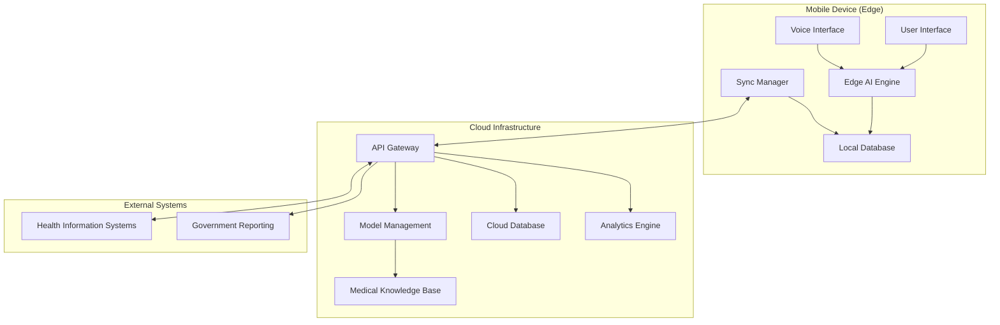

# Design Document: SwasthyaSathi AI

## Overview

SwasthyaSathi AI is a comprehensive healthcare platform designed to bridge the healthcare gap in rural and semi-urban India through AI-powered risk assessment, multilingual voice interaction, and offline-first operation. The system combines edge AI processing with cloud-based model management to deliver reliable healthcare support in low-connectivity environments.

The platform serves three primary user groups: frontline health workers (ASHA, ANM, PHC staff), rural patients, and healthcare administrators. It provides early detection of chronic and infectious diseases through minimal patient input, generates explainable risk scores, and offers care navigation through intelligent referral recommendations.

Key design principles include offline-first operation, cultural and linguistic accessibility, privacy-by-design, and scalable deployment across diverse rural environments with varying infrastructure capabilities.

## Architecture

### High-Level Architecture



### Edge-Cloud Hybrid Design

The system employs a hybrid architecture where critical AI processing occurs at the edge (mobile device) while leveraging cloud resources for model updates, analytics, and data synchronization. This design ensures functionality in offline scenarios while maintaining the benefits of centralized learning and management.

**Edge Components:**
- Lightweight AI models optimized for mobile deployment
- Local patient data storage with encryption
- Voice processing and multilingual support
- Risk scoring algorithms with cached medical knowledge
- Offline-capable user interface

**Cloud Components:**
- Full-scale AI model training and optimization
- Centralized patient data aggregation and analytics
- Model versioning and deployment management
- Integration with external health information systems
- Population health insights and reporting

## Components and Interfaces

### 1. Edge AI Engine

The Edge AI Engine is the core processing component that runs locally on mobile devices, providing real-time risk assessment without requiring internet connectivity.

**Key Responsibilities:**
- Process patient symptoms, vitals, and demographic data
- Generate risk scores for chronic and infectious diseases
- Provide explainable AI predictions with reasoning
- Manage local medical knowledge base
- Handle model inference optimization for mobile hardware

**Technical Implementation:**
- Quantized neural networks optimized for ARM processors
- TensorFlow Lite or ONNX Runtime for mobile inference
- Local caching of medical decision trees and risk algorithms
- Memory-efficient model loading and unloading
- Battery-optimized processing with adaptive computation

**Interfaces:**
- Input: Patient data (symptoms, vitals, demographics, history)
- Output: Risk scores, explanations, confidence levels, recommendations
- Configuration: Model parameters, thresholds, local knowledge updates

### 2. Multilingual Voice Interface

The Voice Interface enables natural language interaction in multiple Indian languages, supporting both speech-to-text and text-to-speech functionality offline.

**Key Responsibilities:**
- Convert speech to text in 8+ Indian languages
- Generate natural speech output from text responses
- Handle regional dialects and accents
- Provide culturally appropriate interaction patterns
- Manage voice data privacy and local processing

**Technical Implementation:**
- Offline ASR models based on Wav2Vec2 or Whisper architectures
- Language-specific acoustic and language models
- Text-to-speech synthesis using neural vocoders
- Dialect adaptation through transfer learning
- Voice activity detection and noise reduction

**Supported Languages:**
- Hindi, Bengali, Telugu, Marathi, Tamil, Gujarati, Kannada, Malayalam
- Regional dialect support within major language families
- Code-switching detection for mixed-language conversations

**Interfaces:**
- Audio Input: Raw audio streams from device microphone
- Audio Output: Synthesized speech for patient communication
- Text Interface: Bidirectional text conversion for system integration

### 3. Patient Data Management System

The Patient Data Management System handles secure storage, retrieval, and synchronization of patient records across edge and cloud environments.

**Key Responsibilities:**
- Maintain encrypted local patient records
- Track patient history and assessment trends
- Manage data consistency across offline/online modes
- Implement privacy controls and access management
- Handle data retention and deletion policies

**Technical Implementation:**
- SQLite database with SQLCipher encryption
- JSON-based patient record schema
- Differential synchronization algorithms
- Conflict resolution using vector clocks
- GDPR-compliant data handling procedures

**Data Schema:**
- Patient demographics and identifiers
- Assessment history with timestamps
- Risk scores and explanations over time
- Referral records and outcomes
- Voice interaction logs (anonymized)

### 4. Synchronization Manager

The Sync Manager orchestrates data flow between edge devices and cloud infrastructure, ensuring data consistency and handling connectivity variations.

**Key Responsibilities:**
- Detect network connectivity and quality
- Prioritize critical data for synchronization
- Handle sync conflicts and data reconciliation
- Manage bandwidth-efficient data transfer
- Coordinate model and knowledge base updates

**Technical Implementation:**
- Background sync with exponential backoff
- Delta synchronization to minimize data transfer
- Compression and deduplication algorithms
- Offline queue management with persistence
- Network-aware sync scheduling

**Sync Priorities:**
1. High-risk patient alerts and referrals
2. New patient assessments and critical updates
3. Model updates and knowledge base changes
4. Historical data and analytics information
5. System logs and performance metrics

### 5. Risk Assessment Engine

The Risk Assessment Engine implements medical decision-making algorithms that evaluate patient data and generate actionable risk scores.

**Key Responsibilities:**
- Calculate disease-specific risk scores
- Provide explainable AI reasoning
- Integrate patient history for improved accuracy
- Generate referral recommendations
- Maintain clinical decision support rules

**Risk Scoring Algorithms:**
- Cardiovascular risk using Framingham-derived models
- Diabetes risk assessment based on Indian population data
- Hypertension screening with lifestyle factors
- Infectious disease risk using symptom patterns
- Mental health screening with cultural considerations

**Explainable AI Features:**
- Feature importance visualization
- Natural language explanations of risk factors
- Confidence intervals and uncertainty quantification
- Comparative risk analysis with population norms
- Actionable recommendations for risk reduction

### 6. Referral and Care Navigation System

The Referral System provides intelligent care navigation by analyzing risk assessments and recommending appropriate healthcare interventions.

**Key Responsibilities:**
- Generate referral recommendations based on risk scores
- Consider local healthcare facility availability
- Provide urgency classification and timelines
- Track referral outcomes and effectiveness
- Integrate with existing healthcare workflows

**Referral Categories:**
- Immediate (within 24 hours): Critical conditions requiring urgent care
- Urgent (within 1 week): Conditions needing prompt medical attention
- Routine (within 1 month): Preventive care and chronic disease management
- Self-care: Lifestyle modifications and home-based interventions

## Data Models

### Patient Record Schema

```json
{
  "patientId": "string (UUID)",
  "demographics": {
    "age": "integer",
    "gender": "enum [male, female, other]",
    "location": {
      "village": "string",
      "district": "string",
      "state": "string"
    },
    "preferredLanguage": "string"
  },
  "assessments": [
    {
      "assessmentId": "string (UUID)",
      "timestamp": "ISO 8601 datetime",
      "symptoms": ["array of symptom codes"],
      "vitals": {
        "bloodPressure": {"systolic": "integer", "diastolic": "integer"},
        "heartRate": "integer",
        "temperature": "float",
        "weight": "float",
        "height": "float"
      },
      "riskScores": {
        "cardiovascular": {"score": "float", "confidence": "float"},
        "diabetes": {"score": "float", "confidence": "float"},
        "hypertension": {"score": "float", "confidence": "float"}
      },
      "explanations": {
        "primaryFactors": ["array of risk factors"],
        "recommendations": ["array of recommendations"]
      },
      "referrals": [
        {
          "type": "enum [immediate, urgent, routine]",
          "specialty": "string",
          "reason": "string",
          "facility": "string"
        }
      ]
    }
  ],
  "metadata": {
    "createdAt": "ISO 8601 datetime",
    "lastUpdated": "ISO 8601 datetime",
    "syncStatus": "enum [synced, pending, conflict]"
  }
}
```

### Voice Interaction Schema

```json
{
  "interactionId": "string (UUID)",
  "patientId": "string (UUID)",
  "timestamp": "ISO 8601 datetime",
  "language": "string",
  "audioMetadata": {
    "duration": "float (seconds)",
    "sampleRate": "integer",
    "quality": "enum [high, medium, low]"
  },
  "transcription": {
    "text": "string",
    "confidence": "float",
    "alternativeTranscriptions": ["array of strings"]
  },
  "intent": {
    "category": "enum [symptom_report, question, clarification]",
    "entities": ["array of extracted entities"],
    "confidence": "float"
  },
  "response": {
    "text": "string",
    "audioGenerated": "boolean",
    "language": "string"
  }
}
```

### Medical Knowledge Schema

```json
{
  "knowledgeVersion": "string (semantic version)",
  "lastUpdated": "ISO 8601 datetime",
  "diseases": [
    {
      "diseaseId": "string",
      "name": "string",
      "category": "enum [chronic, infectious, mental_health]",
      "riskFactors": [
        {
          "factor": "string",
          "weight": "float",
          "description": "string"
        }
      ],
      "symptoms": [
        {
          "symptom": "string",
          "severity": "enum [mild, moderate, severe]",
          "specificity": "float"
        }
      ],
      "referralCriteria": {
        "immediate": ["array of conditions"],
        "urgent": ["array of conditions"],
        "routine": ["array of conditions"]
      }
    }
  ],
  "guidelines": [
    {
      "guidelineId": "string",
      "title": "string",
      "source": "string",
      "applicableRegions": ["array of regions"],
      "recommendations": ["array of clinical recommendations"]
    }
  ]
}
```

## Correctness Properties

*A property is a characteristic or behavior that should hold true across all valid executions of a system—essentially, a formal statement about what the system should do. Properties serve as the bridge between human-readable specifications and machine-verifiable correctness guarantees.*

After analyzing the acceptance criteria, I identified several properties that can be combined or are logically redundant. For example, properties about offline functionality can be consolidated, and several data handling properties share common validation patterns. The following properties represent the essential correctness guarantees after eliminating redundancy:

### Property 1: Risk Score Generation Completeness
*For any* valid patient input (symptoms, age, gender, vitals), the Risk_Scorer should generate risk scores for all configured diseases within the specified time limit and provide explanations for each score.
**Validates: Requirements 1.1, 1.2**

### Property 2: Input Validation and Missing Data Detection
*For any* incomplete patient input, the Risk_Scorer should identify all missing critical information and request specific additional inputs without proceeding to generate incomplete risk assessments.
**Validates: Requirements 1.3**

### Property 3: Risk-Based Alerting
*For any* risk score that exceeds predefined thresholds, the system should flag the case as high-risk and trigger appropriate alerts with correct urgency classification.
**Validates: Requirements 1.4, 6.4**

### Property 4: Multilingual Voice Processing
*For any* text input in supported languages, the Voice_Interface should convert it to natural-sounding speech, and for any unclear voice input, it should request clarification in culturally appropriate language.
**Validates: Requirements 2.3, 2.4**

### Property 5: Offline Functionality Preservation
*For any* core system function, when network connectivity is unavailable, the system should continue to operate with full functionality using local resources and cached knowledge.
**Validates: Requirements 3.1, 3.2, 3.4**

### Property 6: Offline Data Integrity
*For any* patient interaction or assessment performed offline, the system should store the data locally with complete integrity and make it available for synchronization when connectivity returns.
**Validates: Requirements 3.3, 4.2**

### Property 7: Seamless Connectivity Transitions
*For any* transition between online and offline modes, the system should maintain full functionality without user intervention and automatically initiate synchronization when connectivity becomes available.
**Validates: Requirements 3.5, 4.1**

### Property 8: Sync Conflict Resolution
*For any* data conflicts during synchronization, the Sync_Manager should resolve them using timestamp-based priority while maintaining data consistency across all affected records.
**Validates: Requirements 4.3**

### Property 9: Knowledge Base Update Integration
*For any* medical knowledge base or AI model update, the system should download, validate, and deploy updates automatically, with rollback capability if validation fails.
**Validates: Requirements 4.4, 10.1, 10.2, 10.3, 10.5**

### Property 10: Patient Record Lifecycle Management
*For any* patient, the system should create and maintain complete records containing all interactions and assessments, display historical data when accessing returning patients, and use history to improve risk scoring accuracy.
**Validates: Requirements 5.1, 5.2, 5.3**

### Property 11: Health Trend Monitoring
*For any* patient with multiple assessments over time, the system should track health trends and generate alerts when significant changes in risk profiles are detected.
**Validates: Requirements 5.4**

### Property 12: Audit Trail Generation
*For any* access to patient data, the system should create audit logs that track access while maintaining patient privacy and data protection requirements.
**Validates: Requirements 5.5, 7.4**

### Property 13: Intelligent Referral Generation
*For any* risk assessment indicating need for higher-level care, the Referral_Engine should generate appropriate referrals with correct urgency levels, considering local facility availability and providing clear instructions.
**Validates: Requirements 6.1, 6.2, 6.3, 6.5**

### Property 14: Data Security Round-Trip
*For any* patient data, when stored locally or transmitted, it should be encrypted using specified standards, and when retrieved, it should maintain integrity and confidentiality.
**Validates: Requirements 7.1, 7.2, 7.3**

### Property 15: Secure Data Deletion
*For any* patient data that exceeds retention periods, the system should securely delete it according to data retention policies, ensuring it cannot be recovered.
**Validates: Requirements 7.5**

### Property 16: Healthcare Integration Data Consistency
*For any* patient data exported to or imported from external healthcare systems, the system should maintain data consistency using standardized formats and patient identifiers.
**Validates: Requirements 9.1, 9.3, 9.5**

### Property 17: Compliance Report Generation
*For any* reporting request, the system should generate summaries that comply with government health reporting requirements and maintain proper data formatting.
**Validates: Requirements 9.4**

### Property 18: Model Version Control
*For any* AI model deployment, the system should maintain version control information and allow administrators to track deployment status across all devices in the system.
**Validates: Requirements 10.4**

## Error Handling

### Network Connectivity Errors
The system implements graceful degradation when network connectivity is lost or unreliable. All core functions continue operating using cached data and local processing capabilities. Network errors are logged locally and sync operations are queued for retry with exponential backoff.

### Voice Processing Errors
When voice input cannot be processed due to poor audio quality, background noise, or unsupported dialects, the system provides clear feedback and alternative input methods. Text-to-speech errors fallback to text display with visual indicators.

### AI Model Errors
If AI models fail to generate risk scores due to corrupted data or model issues, the system logs the error, attempts to use backup models, and provides manual assessment workflows for healthcare workers.

### Data Synchronization Errors
Sync conflicts are resolved using timestamp-based priority with manual override capabilities for healthcare administrators. Data corruption is detected using checksums and triggers automatic re-sync from authoritative sources.

### Security and Privacy Errors
Authentication failures trigger secure lockout procedures with audit logging. Data encryption errors prevent system operation until resolved. Privacy violations are logged and reported according to compliance requirements.

## Testing Strategy

### Dual Testing Approach
The system requires both unit testing and property-based testing for comprehensive coverage:

**Unit Tests** focus on:
- Specific examples of risk scoring algorithms
- Edge cases in voice processing and language detection
- Integration points between edge and cloud components
- Error conditions and security boundary testing
- Specific healthcare workflow scenarios

**Property-Based Tests** focus on:
- Universal properties that hold across all patient inputs
- Data consistency across offline/online transitions
- Security properties for all data handling operations
- Referral generation correctness across all risk levels
- Synchronization behavior across all network conditions

### Property-Based Testing Configuration
- **Testing Framework**: Use Hypothesis (Python) or fast-check (TypeScript) for property-based testing
- **Test Iterations**: Minimum 100 iterations per property test to ensure comprehensive input coverage
- **Test Tagging**: Each property test must reference its design document property using the format:
  - **Feature: swasthya-sathi-ai, Property {number}: {property_text}**

### Healthcare-Specific Testing Considerations
- **Medical Data Generators**: Create realistic but synthetic patient data for testing
- **Multilingual Test Data**: Generate test cases across all supported Indian languages
- **Offline/Online Scenarios**: Test all combinations of connectivity states
- **Performance Testing**: Validate response times on minimum hardware specifications
- **Security Testing**: Verify encryption, access control, and data protection measures
- **Compliance Testing**: Ensure adherence to healthcare data regulations and standards

### Integration Testing
- **External System Integration**: Test data exchange with health information systems
- **Voice Processing Pipeline**: End-to-end testing of speech-to-text and text-to-speech
- **AI Model Updates**: Test model deployment and rollback procedures
- **Multi-device Synchronization**: Verify data consistency across multiple devices
- **Load Testing**: Validate system performance under concurrent user loads